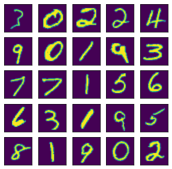
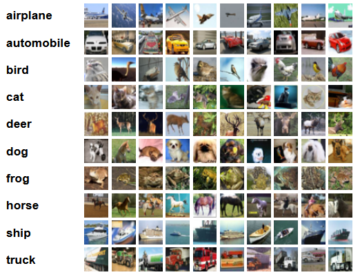

# Image Labelling with ConvNet and ResNet

**Task:** Computer Vision — Image Classification &nbsp;|&nbsp; **Architectures:** ConvNet, ResNet-34, ResNet-101

---

## Abstract

This project replicates established image classification results across four benchmark datasets: MNIST, EMNIST, CIFAR-10, and CIFAR-100. Two architecture families are implemented — a standard convolutional network (ConvNet) applied to the handwritten digit and letter tasks, and deep residual networks (ResNet-34 and ResNet-101) applied to the CIFAR benchmarks. The goal is to reproduce known performance levels and develop a working understanding of how network depth and residual connections affect classification on datasets of varying difficulty.

---

## 1. Datasets

**MNIST** [3] is a grayscale handwritten digit dataset of 70,000 images (60,000 train / 10,000 test) at 28×28 resolution, covering 10 digit classes. It serves as a standard baseline for evaluating convolutional architectures.

**EMNIST** [4] extends MNIST to handwritten letters and digits, using the same 28×28 format. The Balanced split covers 47 classes (digits and upper/lower case letters merged where similar), with substantially more within-class variation than digits, making classification meaningfully harder despite identical image dimensions.

**CIFAR-10** [5] contains 60,000 RGB images at 32×32 resolution across 10 object categories (airplane, automobile, bird, cat, deer, dog, frog, horse, ship, truck), split 50,000/10,000 for train and test.

**CIFAR-100** [5] shares the same format and scale as CIFAR-10 but expands to 100 fine-grained classes grouped into 20 superclasses, with only 500 training images per class.

  
  &nbsp;&nbsp;&nbsp;
  

---

## 2. Architectures

### 2.1 ConvNet

The ConvNet used for MNIST and EMNIST follows the classical convolutional architecture introduced by LeCun et al. [1]: alternating convolutional and pooling layers extract spatial features, followed by fully connected layers that map the resulting feature representation to class logits.

### 2.2 ResNet

For CIFAR-10 and CIFAR-100, two depths of the residual network architecture [2] are implemented: ResNet-34 and ResNet-101. The core contribution of ResNet is the identity shortcut connection, which allows gradients to flow directly through the network without passing through non-linear transformations:

$$\mathbf{y} = \mathcal{F}(\mathbf{x},\, \{W_i\}) + \mathbf{x}$$

where $\mathcal{F}$ represents the residual mapping to be learned. This formulation makes it tractable to train networks of significantly greater depth than was previously practical, addressing the degradation problem observed in plain deep networks.

ResNet-34 uses basic residual blocks (two 3×3 convolutions per block), while ResNet-101 uses bottleneck blocks (1×1 → 3×3 → 1×1) to manage parameter count at greater depth.

---

## 3. References

[1] LeCun, Y., Haffner, P., Bottou, L., & Bengio, Y. (1999). Object Recognition with Gradient-Based Learning. *Shape, Contour and Grouping in Computer Vision*. http://yann.lecun.com/exdb/publis/pdf/lecun-99.pdf

[2] He, K., Zhang, X., Ren, S., & Sun, J. (2015). Deep Residual Learning for Image Recognition. *arXiv:1512.03385*. https://arxiv.org/abs/1512.03385v1

[3] LeCun, Y., & Cortes, C. MNIST handwritten digit database. http://yann.lecun.com/exdb/mnist/

[4] Cohen, G., Afshar, S., Tapson, J., & van Schaik, A. (2017). EMNIST: an extension of MNIST to handwritten letters. *arXiv:1702.05373*. https://arxiv.org/abs/1702.05373v1

[5] Krizhevsky, A., Nair, V., & Hinton, G. The CIFAR-10 and CIFAR-100 Datasets. https://www.cs.toronto.edu/~kriz/cifar.html

[6] Baiyu @BUPT. Practice on CIFAR100 using PyTorch. https://github.com/weiaicunzai/pytorch-cifar100
